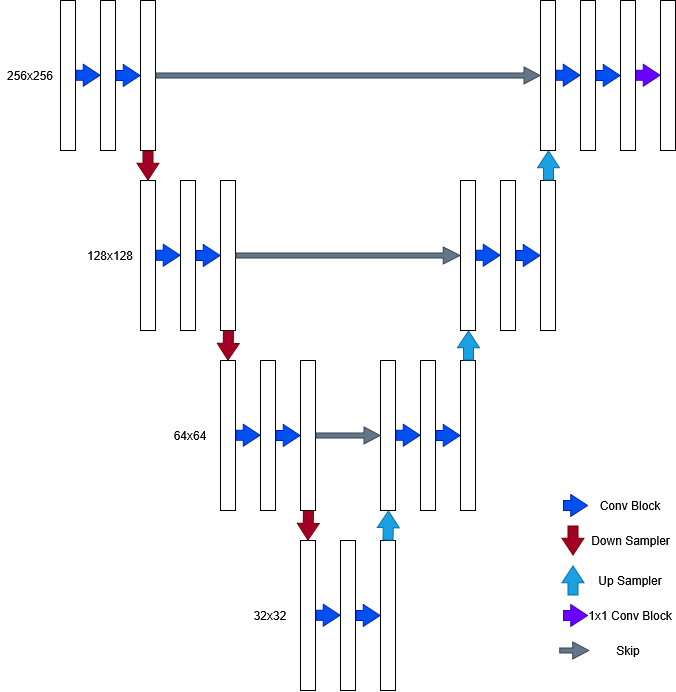
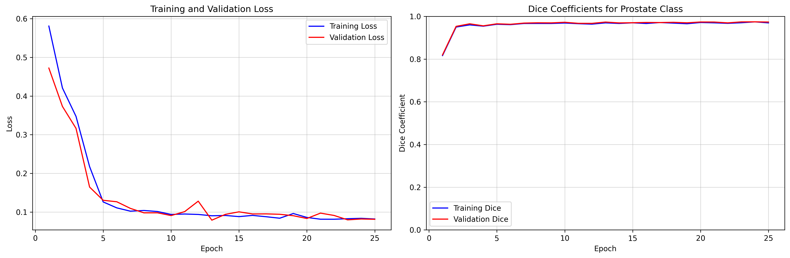

# Hip MRI Improved 2D UNet
Author: Mitchell Hall

Student Number: 46978581

## Introduction
This project implements a 2D Improved UNet on the HipMRI Study on Prostate Cancer dataset. The 2D Improved UNet is an
Encoder-Decoder algorithm with skip connections. It passes images through double convolution blocks with Leaky ReLU for 
encoding, a strided convolution block for downsampling, and a transpose convolution block for upsampling.



## Project Structure
The repository is comprised of the following files:
```
| 4697858-HipMRI-IUNET/
|   | images/ # README image files
|   |   | IUNet.png
|   |   | training_curves.png
|   | dataset.py # Data loading and structuring
|   | modules.py # IUNet architecture
|   | predict.py
|   | train.py # Model training
|   | utils.py # Helper functions
|   | README.md
|   | requirements.txt # pip package requirements
```
## Usage
### Dependencies
As listed in requirements.txt
```
tqdm (4.67.1)
numpy (2.2.6)
torch (2.8.0)
torchvision (0.23.0)
matplotlib (3.10.6)
scipy (1.16.2)
nibabel (5.3.2)
scikit-learn (1.7.2)
```

### Installation
1. Install dependencies using pip

`pip install -r requirements.txt`
2. Retrieve HipMRI data
```
| data/
|   | keras_slices_seg_test/        # Testing masks
|   | keras_slices_seg_train/       # Training masks
|   | keras_slices_seg_validate/    # Validation masks
|   | keras_slices_test/            # Testing images
|   | keras_slices_train/           # Training images
|   | keras_slices_validate/        # Validation images
```

### Running
Run the following command

`python train.py [--directory] [--batch_size] [--num_workers] [--target_label] [--epochs] [--dice_weight] [--smooth] [--num_classes] [--output] [--learning_rate] [--weight_decay] [--patience] [--resume] [--save_frequency] [--resume_checkpoint]`

The optional parameters are:

- --directory (default: ./data): The directory HipMRI data is stored
- --batch_size (default: 16): The size of the worker batches
- --num_workers (default: 4): The number of parallel workers assigned
- --target_label (default: 1): The expected label of the prostate
- --epochs (default: 100): Maximum number of epochs to train for
- --dice_weight (default: 0.5): Weighting of the DICE
- --smooth (default: 1.0): Smoothing factor
- --num_classes (default: 6): Number of classes within the dataset
- --output (default: ./output): Directory for output files
- --learning_rate (default: 1e-4): Rate of learning
- --weight_decay (default: 1e-5): Weight decay
- --patience (default: 10): Number of iterations before early stopping
- --resume: Whether to continue from a saved checkpoint
- --save_frequency (default: 10): Number of epochs before a checkpoint is saved
- --resume_checkpoint (default: None): Path to checkpoint to load (required --resume flag)

## Pre-processing
Data was normalised using z-score normalisation with the formula:

`normalised = (image - mean) / std`

This was done to standardise intensities across multiple methods of data acquisition

The images were also augmented in the training phase randomly, with each augmentation having a 50% chance of being applied

- Horizontal flip
- Vertical flip
- Rotation +/- 15 degrees
- Brightness adjustment +/- 20%
- Contrast adjustment +/- 20%

Additionally, only the images set was given a 30% chance of each image applying Gaussian noise

These augmentations increased the data diversity to provide more cases to test against and increase the speed at which a solution converges.
## Example Results

The model was trained under default parameters on an a100 GPU for 25 epochs. By the second epoch, the DICE similarity
coefficient had already reached a value close to its convergence point. Meanwhile, the DICE loss calculated for the
training and validation phases decreased from 0.6 to 0.1 in roughly 5 epochs before slowly reducing across the remaining
epochs. The solution did not converge in time to trigger an early stop, but it did find a solution quickly, displaying
DICE similarity >= 0.75 for all labels within the 25 epoch training period.